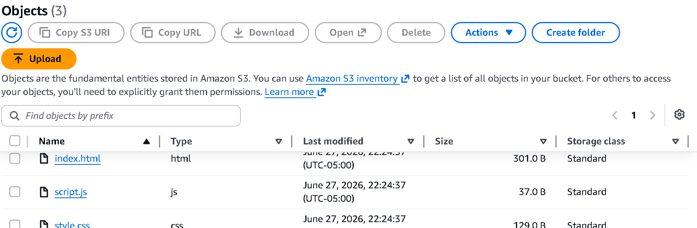
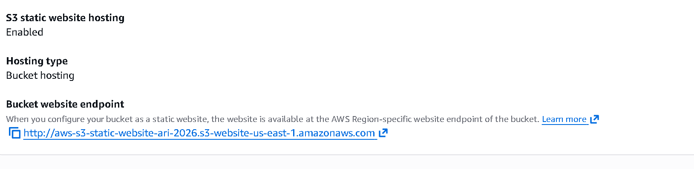
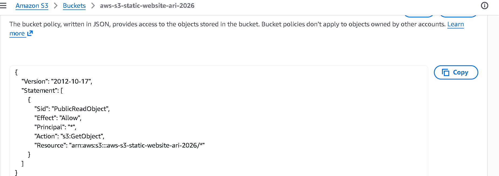
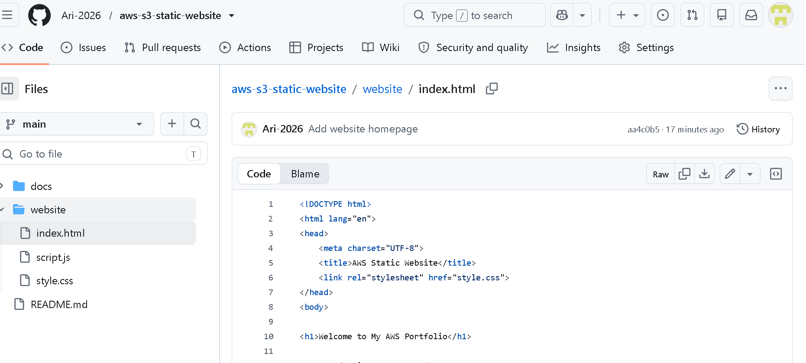

# AWS S3 Static Website Hosting

## Overview

This project demonstrates how to host a static website using Amazon S3.

## AWS Services

- Amazon S3
- IAM

## Status

🚧 Project in Progress

## Project Architecture

```
Users
   │
   ▼
Web Browser
   │
   ▼
Amazon S3 Static Website Hosting
   │
   ▼
HTML • CSS • JavaScript Files
```

## Project Structure  

```text
aws-s3-static-website/
│
├── architecture/
├── docs/
├── screenshots/
│   ├── github-repository.png
│   ├── s3-bucket-objects.png
│   ├── s3-bucket-policy.png
│   ├── s3-static-webhosting.png
│   └── website-homepage.png
│
├── website/
│   ├── index.html
│   ├── style.css
│   └── script.js
│
└── README.md
```

## Deployment Steps

1. Created an Amazon S3 bucket.
2. Enabled Static Website Hosting.
3. Uploaded the website files (`index.html`, `style.css`, and `script.js`).
4. Configured a bucket policy to allow public read access.
5. Disabled Block Public Access for the bucket.
6. Verified the website using the S3 website endpoint.
7. Documented the project with screenshots and a README.

## Skills Demonstrated

- Amazon S3
- Static Website Hosting
- S3 Bucket Policies
- IAM Fundamentals
- Git Version Control
- GitHub Repository Management
- HTML
- CSS
- JavaScript
- Technical Documentation

## Future Improvements

- Configure a custom domain with Amazon Route 53.
- Enable HTTPS using Amazon CloudFront and AWS Certificate Manager.
- Automate deployments using GitHub Actions.
- Monitor website access with Amazon CloudWatch.

## Screenshots

### Live Website


### Amazon S3 Bucket


### Static Website Hosting


### Bucket Policy


### GitHub Repository
